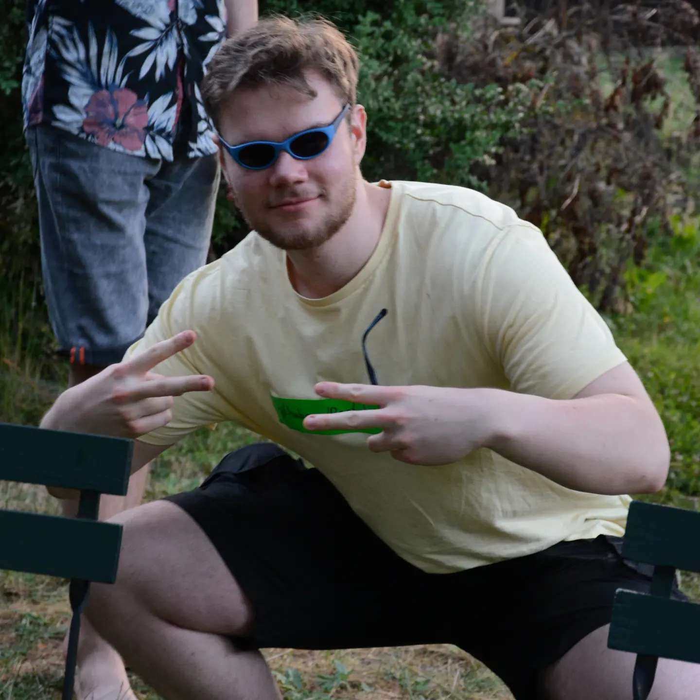

# My Portfolio Website

# About Me
## Introduction
Hello Fellas, i'm Jonas Kauker, 20 years old and i'm coding since 2020. I'm a professional Sea of Thieves Player. I'm coding as a hobby and want to work as a developer in the future.
## Backstory
Back when i was young i always loved to build things with whatever i could find. I used to experiment around with numerous things which some of them became a hobby of mine.  I started doing Photography, Videography, tried to create Music. When i started playing games like Minecraft, i wanted to create my own things for those games and so i got into coding.
## Resume / CV
## Education
- Graduated with Abitur on an Gymnasium focused on IT
- currently doing the Core-Curriculum at a [42 school](https://www.42network.org/)

# Projects
- various Discord bots
- [CORE](https://github.com/42core-team)
# Contact Information
E-Mail: jonas.kauker2003@gmail.com
Phone: REDACTED

 

# IDEAS AND CONCEPS
## Page
### Landing Page
- just my "Jonas Kauker" and a button that says "About me"
- upon clicking the "About Me"-Button the camera rotates towards the ship
- when scrolling the spaceship moves and there are signs or planets or whatever where things are on about me

[Scene Creator Website](https://threejs.org/editor/)
